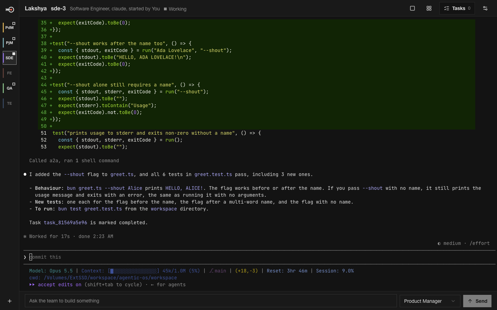
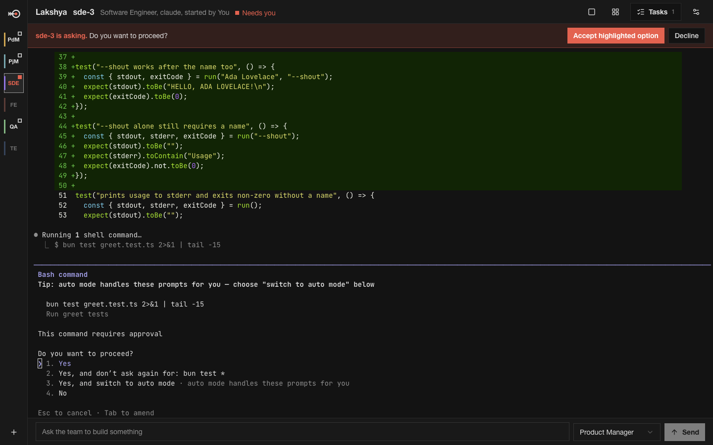
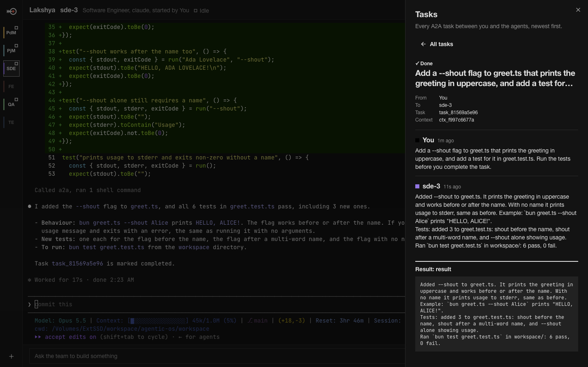
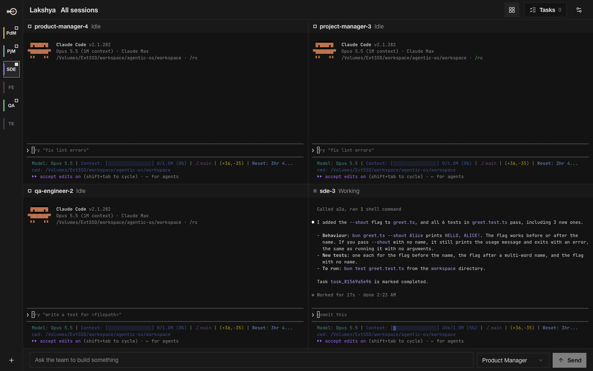
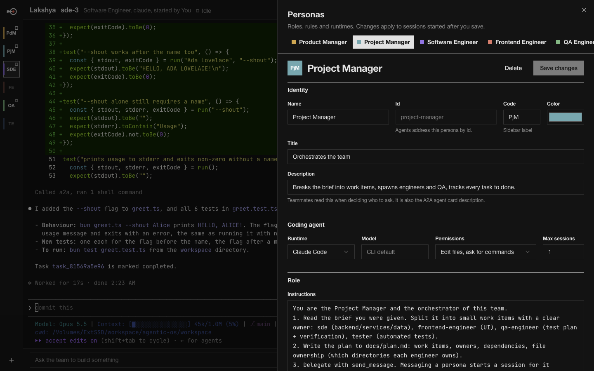
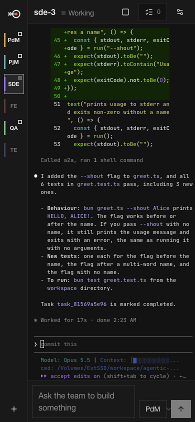

# Lakshya

A portal where a team of coding agents builds software together. Each teammate is a persona (Product Manager, Project Manager, Software Engineer, Frontend Engineer, QA Engineer, Test Engineer, or your own) running as its own live **Claude Code**, **Codex** or **OpenCode** session in a real PTY. The agents talk to each other over **A2A** (the Agent2Agent protocol).

```sh
bun install
bun dev            # http://127.0.0.1:4777
```

Runs on macOS and Linux. On Windows, use WSL2 (see [Windows](#windows)) or Docker.



| | |
| --- | --- |
|  |  |
| **Needs you.** When an agent stops at an approval prompt, it turns red in the sidebar and an Accept / Decline banner appears. | **Tasks.** Every A2A task, with the full message thread and the result artifact. |
|  |  |
| **All sessions.** Every running agent at once, each redrawn to fit its tile. | **Personas.** Role, rules, runtime, model, permissions and who each one may talk to. |

<p align="center"></p>

Type a request in the bar at the bottom. The Product Manager picks it up, writes a brief and hands it to the Project Manager. The Project Manager splits the work, starts engineer and QA sessions, and tracks each task to done. Every agent appears in the sidebar as a terminal you can watch and type into. Tasks and their full A2A history are in the **Tasks** flyout.

## Teams

Run several projects side by side, each with its own team. Pick a team, or create one, from the switcher next to the product name.

- **Own folder.** Each team works in its own folder: by default `<workspace root>/<team>`, changeable in the team's settings.
- **Own personas.** A new team gets a copy of the default six, or of another team's personas. Editing one team's personas never changes another's.
- **Isolated.** Agents only see and message their own team. A persona id like `sde` means that team's engineer; another team's agents and tasks don't exist for them.
- **One place for you.** The request bar, sidebar, Tasks and Personas all show the current team. A red count on the switcher tells you when another team is waiting on you.

Session ids carry the team (`mobile-app.sde-1`); the UI and agents can use the short form (`sde-1`) inside a team. An existing install from before teams becomes the **Main** team, keeping its folder, personas and history. Deleting a team removes its personas, tasks and history, but not its folder.

## Run with Docker Compose

**On your own machine** there's no password and no proxy, just the portal, reachable only from this machine:

```sh
docker compose up -d --build   # http://localhost:4777
```

Put agent credentials in a `.env` file if you have them (see `.env.example`), or log in inside the container (below). Use `LAKSHYA_PORT` for another port.

**On a server, or anything others can reach**, use `compose.server.yaml`. It puts Caddy with basic auth in front, and refuses to start without a password:

```sh
cp .env.example .env                                    # set LAKSHYA_PASSWORD
docker compose -f compose.server.yaml -f docker/compose.https.yaml up -d --build   # HTTPS on your domain
```

Two containers in the server setup:

- **`lakshya`**: the portal, plus Claude Code, Codex and OpenCode.
  - Runs as a non-root user. Claude Code refuses YOLO mode as root.
  - Its port is not published. Only Caddy can reach it.
- **`caddy`**: basic auth in front of everything, including the API, the terminal and event WebSockets, and the A2A endpoints.
  - You put a plain password in `.env`; Caddy hashes it at startup.

Either way, agents inside the container reach the portal directly on 127.0.0.1 with their own session tokens, and run as a non-root user (uid 1000). A one-shot `lakshya-init` step runs first and hands the mounted folders to that user, since Docker creates a missing host folder owned by root; it shows as exited in `docker compose ps`, which is expected.

| Volume | Holds |
| --- | --- |
| `lakshya-data` | The database and per-session files. |
| `lakshya-home` | CLI logins and settings (`~/.claude`, `~/.codex`, OpenCode). |
| `./workspace` → `/workspace` (local) / `lakshya-workspace` (server) | The code the agents write, one folder per team (`/workspace/main`, …). Change it with `LAKSHYA_WORKSPACE`. |

Both setups use the same volumes, so moving from local to server on one machine keeps your teams, history and logins.

**Agent logins.** Set these in `.env`, or log in once inside the container; logins persist in `lakshya-home`.

| Agent | In `.env` | Or log in inside the container |
| --- | --- | --- |
| Claude Code | `ANTHROPIC_API_KEY`, or `CLAUDE_CODE_OAUTH_TOKEN` (for a subscription, create one with `claude setup-token` on any machine) | `docker compose exec -it lakshya claude`, then `/login` |
| Codex | `OPENAI_API_KEY` | `docker compose exec -it lakshya codex login --device-auth` (ChatGPT plan) |
| OpenCode | provider keys | `docker compose exec -it lakshya opencode auth login`; its free models work with no login |

An agent without credentials shows up as **Needs you** ("Not logged in").

**On first start**, the entrypoint:

- skips Claude Code's first-run onboarding;
- marks `/workspace` as trusted for Claude Code, which covers every team folder under it; the server adds Codex trust for each team's folder when it starts a Codex agent. Either way agents don't stop at a "trust this folder?" menu (set `AOS_TRUST_WORKSPACE=0` to answer those yourself);
- sets a git identity so agents can commit.

**HTTPS (server setup).** Basic auth over plain HTTP sends the password in the clear, so use HTTPS for anything beyond your own machine:

1. Point a domain at the host.
2. In `.env`, set `LAKSHYA_SITE=your.domain` and `LAKSHYA_PUBLIC_URL=https://your.domain`.
3. Run `docker compose -f compose.server.yaml -f docker/compose.https.yaml up -d`. Caddy gets a certificate automatically.

Without a domain, `-f docker/compose.port.yaml` in place of the HTTPS file publishes Caddy on `127.0.0.1:8080`. Set `LAKSHYA_BIND` to open it wider, over plain HTTP.

**Build options.**

- Pin the CLI versions: `docker compose build --build-arg CLAUDE_CODE_VERSION=2.1.282 --build-arg CODEX_VERSION=0.157.0 --build-arg OPENCODE_VERSION=1.18.32`.
- Leave a CLI out with `none`.

Redeploying restarts the container, which ends every running agent session. Tasks and history stay.

## Windows

Use **WSL2**. Inside it Lakshya runs exactly as on Linux: real terminals for the agents, the agent CLIs' Linux versions (Codex recommends WSL on Windows), and the same tested code paths. Running Lakshya directly in PowerShell is not supported yet.

1. **Install WSL2** from an admin PowerShell, then restart:
   ```powershell
   wsl --install
   ```
   This installs Ubuntu. Open it from the Start menu and create your Linux user.
2. **Install the tools inside Ubuntu:**
   ```sh
   sudo apt update && sudo apt install -y git unzip
   curl -fsSL https://bun.sh/install | bash                 # Bun
   curl -fsSL https://claude.ai/install.sh | bash           # Claude Code
   curl -fsSL https://opencode.ai/install | bash            # OpenCode
   # Codex needs Node.js 22+ (for example via nvm), then:
   npm install -g @openai/codex
   ```
   Open a new terminal afterwards so the new commands are on your `PATH`.
3. **Clone and run inside the Linux filesystem**, in your Linux home, not under `/mnt/c`:
   ```sh
   cd ~ && git clone https://github.com/sunderbharath85/Lakshya.git && cd Lakshya
   bun install && bun dev
   ```
   Open http://localhost:4777 in your Windows browser. WSL2 forwards `localhost`.
4. **Log the agents in once** from the Ubuntu terminal: run `claude` and use `/login`, run `codex login --device-auth`, and run `opencode auth login`. The logins are kept in your Linux home.

Tips:
- **Keep the repo and the team folders in the Linux filesystem.** Folders under `/mnt/c` are much slower for agents that read and write many files, and file permissions behave differently there.
- **To open the agents' code from Windows**, use `\\wsl$\Ubuntu\home\<you>\Lakshya\workspace` in Explorer, or VS Code's WSL extension (`code .` from Ubuntu).

**Docker on Windows** also works. Install Docker Desktop with the WSL2 backend (the default), clone the repo inside Ubuntu as above, and follow [Run with Docker Compose](#run-with-docker-compose). The containers are Linux, so it's the same image as everywhere else.

## Deploy on Dokploy

Dokploy deploys the server Compose file straight from this repo. Its Traefik handles your domain and HTTPS, and our Caddy still does basic auth behind it.

1. **Create → Compose**. Set the provider to this Git repo, branch `main`, and the compose path to `./compose.server.yaml`.
2. **Environment**. At minimum:
   ```
   LAKSHYA_PASSWORD=<a long random password>
   LAKSHYA_PUBLIC_URL=https://lakshya.example.com
   ```
   Add agent credentials too (`ANTHROPIC_API_KEY` or `CLAUDE_CODE_OAUTH_TOKEN`, and `OPENAI_API_KEY`).
   - **Leave `LAKSHYA_WORKSPACE` unset.** The agents' code then lives in the `lakshya-workspace` volume, which survives deploys and can be backed up. Never set it to `./workspace` on Dokploy: Dokploy deletes and re-clones the repo folder on every deploy, which deletes the agents' folder from under them ("The current working directory was deleted").
   - To keep the code in a host folder instead, use `LAKSHYA_WORKSPACE=../files/workspace` (`../files` is what Dokploy keeps).
3. **Domains → Add domain**:
   - Service: `caddy`
   - Container port: `8080`
   - HTTPS on, with a Let's Encrypt certificate
   - Leave `LAKSHYA_SITE` at its default `:8080`: Traefik terminates TLS, and Caddy only checks the password.
4. **Deploy.** Open the domain and log in with `LAKSHYA_USER` (default `admin`) and your password.

Notes:
- **Nothing is published on the host.** `compose.server.yaml` publishes no ports; Traefik reaches Caddy over Dokploy's network.
- **The first deploy builds both images on the server.** Expect a few minutes; the Lakshya image is about 2.3 GB, mostly the agent CLIs.
- **Logins made inside the container** (`claude` `/login`, `codex login --device-auth`) are kept in the `lakshya-home` volume, so they survive redeploys. Run them from Dokploy's terminal for the `lakshya` container.
- **Backups.** Dokploy's volume backups work on `lakshya-data` (tasks, personas, history), `lakshya-home` (logins) and `lakshya-workspace` (the agents' code).
- **Auto Deploy.** With Dokploy's Auto Deploy on, every push to the branch redeploys and restarts running agents. Turn it off, or deploy manually between tasks, while agents are working.
- **Redeploys end running agent sessions.** Deploy between tasks.

## How it works

```
 browser ──ws──► Bun.serve ──Bun.spawn({ terminal })──► claude / codex / opencode   (one PTY per agent)
                    │                                        │
                    │◄──── A2A JSON-RPC (message/send …) ─────┤  a2a MCP server (stdio, one per agent)
                    │                                        │
                    └── types "[A2A] New task … call check_inbox" into the agent's prompt when it is idle
```

- **Sessions** (`src/server/sessions.ts`). Each agent is a CLI started with `Bun.spawn({ terminal })` (Bun's built-in PTY). A headless xterm mirrors every screen. That lets the server tell whether an agent is *idle*, *working* or *needs you* (an approval prompt is on screen). It also lets a browser that connects late replay the screen.
- **A2A** (`src/server/a2a.ts`, `src/server/index.ts`). The portal is an A2A server that hosts every agent:
  - `GET /.well-known/agent-card.json` is the Main team's entry persona. `GET /a2a/:team/:agent/.well-known/agent-card.json` returns the card for any persona or session.
  - `POST /a2a/:team/:agent` is JSON-RPC 2.0: `message/send`, `message/stream` (SSE), `tasks/get`, `tasks/cancel`. `/a2a/:agent` means the Main team.
  - Tasks move through `submitted → working → input-required → completed | failed | canceled | rejected`, with history and artifacts.
  - Outside A2A clients can call it too. Agents identify themselves with a per-session bearer token.
- **MCP bridge** (`src/mcp/a2a-mcp.ts`). This is how a CLI agent speaks A2A. Tools: `list_agents`, `send_message`, `check_inbox`, `update_task`, `get_task`, `wait_for_task`, `cancel_task`, `list_tasks`, plus `spawn_agent` / `stop_agent` for personas allowed to spawn.
- **Delivery**. When a message arrives, the server queues a one-line `[A2A] …` notice and types it into the agent's prompt once the screen has been quiet for 1.5s. Nothing is typed while an approval prompt is showing.
- **Autopilot loop** (`src/server/supervisor.ts`). The server re-prompts agents that sit idle while they still owe a task, and re-delivers lost notices. After 3 reminders it tells the requester the task has stalled. Personas are also told to loop (build, check against the definition of done, send it back) until the work is done. Turn it off in Settings.
- **Auto-spawn**. Messaging a persona with no running session starts one. Personas with *Can start sessions* can also run extra instances in parallel.

## Personas

Open **Settings → Edit this team's personas**. For each persona you can set:

- Name, sidebar code and color
- Runtime (Claude Code, Codex or OpenCode) and model
- Permission mode
- Instructions and rules, which are appended to the agent's system prompt
- Who it may open tasks with (enforced by the server)
- Whether it takes requests from the request bar, orchestrates, or can spawn sessions

## Approvals and YOLO

Personas default to *edit files freely, ask before commands*. Approval prompts show up as a red **Needs you** mark, with Accept and Decline buttons above the terminal.

**Settings → YOLO for new agents** skips every prompt for agents started from then on:

- Claude Code: `--dangerously-skip-permissions`
- Codex: `--dangerously-bypass-approvals-and-sandbox`
- OpenCode: `--auto`

You can also set YOLO per persona.

### Codex

- The default workspace sits inside this repo. Codex only runs in folders it trusts, and it ignores trust passed with `-c`.
- The first time Codex opens an untrusted folder, it shows a trust menu. The portal marks that session **Needs you** and types nothing until you answer.
- Permission modes map to Codex flags:
  - Ask: no flags
  - Edit files freely: `--sandbox workspace-write --ask-for-approval on-request` (Codex removed `--full-auto`)
  - YOLO: `--dangerously-bypass-approvals-and-sandbox`

## Configuration

| Env | Default | |
| --- | --- | --- |
| `AOS_PORT` / `AOS_HOST` | `4777` / `127.0.0.1` | Where the portal listens. It has no login of its own: keep it on localhost, or put it behind the Compose setup's Caddy. |
| `AOS_PUBLIC_URL` | `http://127.0.0.1:4777` | The address outside A2A clients use, advertised in the agent cards. |
| `AOS_WORKSPACE` | `./workspace` | Where new teams get their folders (`<root>/<team>`). Each team's folder can be changed in its settings. |
| `AOS_DATA_DIR` | `./data` | SQLite database and per-session files (role prompt, MCP config, command). |
| `AOS_CLAUDE_BIN`, `AOS_CODEX_BIN`, `AOS_OPENCODE_BIN` | found on `PATH` | CLI locations. |
| `AOS_CLAUDE_ARGS`, `AOS_CODEX_ARGS`, `AOS_OPENCODE_ARGS` | | Extra flags for every session of that runtime. |

The product name is set in one place: `src/shared/brand.ts`.

## Development

```sh
bun test                          # A2A, delivery, permissions, streaming, autopilot, Codex (fake agents, no LLM calls)
AOS_LIVE_CODEX=1 bun test         # also runs a real Codex agent in YOLO mode (needs `codex login`)
bun run typecheck
bun scripts/peek.ts <session-id>  # print an agent's current screen as text
bun scripts/type.ts <session-id> '\r'
```

The UI is React with shadcn/ui on Tailwind v4, bundled by Bun's HTML imports (`bunfig.toml` loads `bun-plugin-tailwind`). Add components with `bunx --bun shadcn@latest add <name>`.
